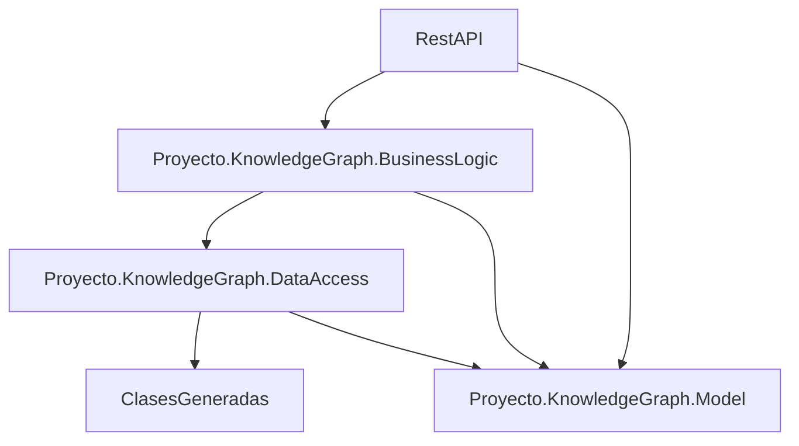

# Gnoss.Akademia.API.CRUD-Example (Ejemplo sencillo de interacción con la API para GNOSS Akademia)

Ejemplo sencillo en el que se utilizan los principales métodos para la interacción con un comunidad GNOSS en el marco de GNOSS Akademia.

- Principales (película, persona)
- Secundarias (género, lugar)

# Proyecto.KnowledgeGraph

Repositorio con las aplicaciones encargadas de generar el grafo de conocimiento de un proyecto sencillo con películas. Las solución utiliza una arquitectura de capas donde se separan las capas de presentación/interacción, lógica de negocios y acceso a datos. 

## Proyectos incluidos en la solución

Las solución utiliza una arquitectura de capas donde se separan las capas de presentación/interacción, lógica de negocios y acceso a datos. 

### RestApi
API REST encargada de la interacción con Drupal para la sincronización de los datos  generados en el CMS. 
|             | Url del servicio                                          | Swagger                                                                    |
|-------------|-----------------------------------------------------------|----------------------------------------------------------------------------|
|Desarrollo   |                                                           |                                                                            |
|Preproducción|                                                           |                                                                            |
|Producción   |                                                           |                                                                            |
### Proyecto.KnowledgeGraph.Model
Modelos de datos.
### Proyecto.KnowledgeGraph.BusinessLogic
Solución central donde se encuentra la lógica de negocio.
### Proyecto.KnowledgeGraph.DataAccess
Solución central donde se encuentra la lógica de acceso a datos.
### ClasesGeneradas
Clases autogeneradas por el framework semántico de GNOSS para la interacción con el mismo.

## Convenciones de codificación
Como regla general este repositorio utiliza las convenciones de escritura de código entandares de C# y que pueden ser consultas en [C# Coding Conventions](https://learn.microsoft.com/en-us/dotnet/csharp/fundamentals/coding-style/coding-conventions) . 

La siguiente tabla resume las convenciones a considerar en la escritura de código en este repositorio
|                         |Regla                          |Ejemplo                             |
|-------------------------|-------------------------------|------------------------------------|
|Campo private            |Camel Case precedido de _     |`private string _userName`           |
|Campo private estático   |Camel Case precedido de s_   |`private static string s_userName`   |
|Campo internal           |Camel Case precedido de _    |`internal string _userName`          |
|Campo internal estático  |Camel Case precedido de s_    |`internal static string s_userName`  |
|Campo protected          |Pascal Case                   |`protected string UserName`          |
|Campo public             |Pascal Case                   |`public string UserName`             |            
|Propiedad                |Pascal Case                   |`public string UserName{get; set;}`  |
|Clase                    |Pascal Case                   |`public class User`                  |
|Enumeración              |Pascal Case                   |`public enum UserType`               |
|Registro                 |Pascal Case                   |`public record User`                 |
|Estructura               |Pascal Case                   |`public struct PhysicalAddress`      |
|Interfaz                 |Pascal Case precedido de I    |`public interface IUser`             |
|Metodo                   |Pascal Case                   |`public void GetUser()`              |
|Variable local           |Camel Case                    |`string userName`                    |
|Parámetro                |Camel Case                    |`public void GetUser(string userId)` |
